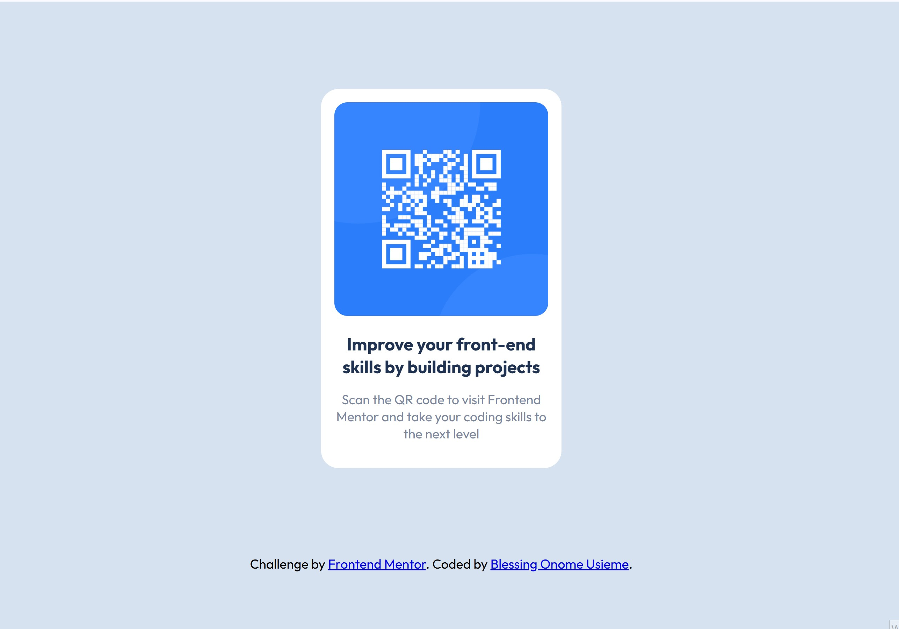

# Frontend Mentor - QR code component solution

This is a solution to the [QR code component challenge on Frontend Mentor](https://www.frontendmentor.io/challenges/qr-code-component-iux_sIO_H). Frontend Mentor challenges help you improve your coding skills by building realistic projects.

# Short description of my solution

A simple and responsive QR code component featuring a centered card layout with a QR image, heading, and supporting text — built to match the Frontend Mentor design challenge.

## Table of contents

- [Frontend Mentor - QR code component solution](#frontend-mentor---qr-code-component-solution)
- [Short description of my solution](#short-description-of-my-solution)
  - [Table of contents](#table-of-contents)
  - [Overview](#overview)
    - [Screenshot](#screenshot)
    - [Links](#links)
  - [My process](#my-process)
    - [Built with](#built-with)
    - [What I learned](#what-i-learned)
    - [Continued development](#continued-development)
    - [Useful resources](#useful-resources)
  - [Author](#author)
  - [Acknowledgments](#acknowledgments)

## Overview

### Screenshot

### Links

-   Solution URL: [Github] (https://github.com/usiemeblessing/qr-code-component)
-   Live Site URL: [Netlify] (https://usiemeblessing-qr-code-component.netlify.app/)

## My process

I began by analyzing the design and setting up the project structure. I then wrote the HTML to structure the content semantically, followed by CSS to style the component and center it on the page. Finally, I refined the layout to match the design as closely as possible.

### Built with

-   Semantic HTML5 markup
-   CSS custom properties

### What I learned

-   I was able to learn how to structure my page using the semantic HTML5 markup
-   I was able to apply a few CSS custom properties
-   The design guide were in JPG static format. Using the design JPGs as guides, I was able to use my best judgment for styles such as font-size, padding and margin.

### Continued development

-   I’d like to continue learning how to write clean, semantic HTML that improves accessibility and structure.
-   I want to continue improving my ability to create fully responsive components that adapt well to various screen sizes using CSS media queries and flexible layout techniques.
-   I want to develop better habits around file organization and naming conventions to keep my projects maintainable.
-   I want to sharpen my eye for design precision, focusing on replicating layouts as closely as possible to improve attention to detail.

### Useful resources

-   (https://www.youtube.com/watch?v=zutb5Clb_0Y&t=1123s) - This Youtube channel taught HTML in detail and greatly helped me gain valuable knowledge on HTML. I really liked the tutorial and will recommend it to anyone just starting off their web development journey.

## Author

-   Frontend Mentor - [@usiemeblessing](https://www.frontendmentor.io/profile/usiemeblesssing)

## Acknowledgments

I would like to acknowledge the Future Fullstack YouTube channel for providing clear and valuable HTML tutorials that contributed greatly to my understanding during this project.
